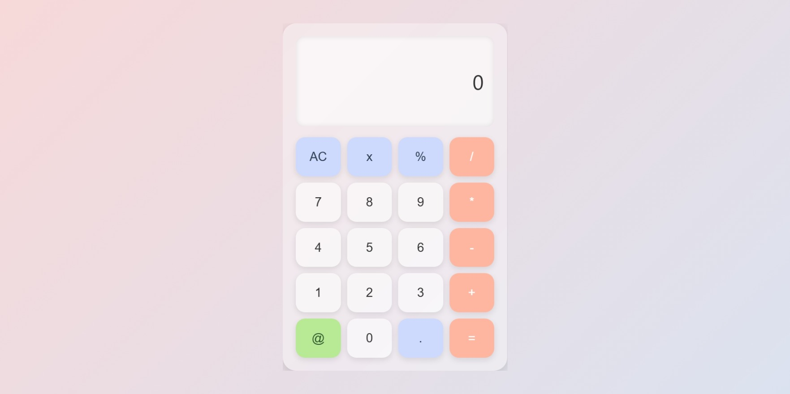

🧮 Modern Calculator
A stylish, minimalist calculator created with HTML, CSS, and JavaScript. The project demonstrates working with the DOM, event handling, basic calculation logic, and a responsive UI in the glassmorphism style.

✨ Features

🔢 Classic arithmetic operations

🧼 Clearing all or the last character

💎 Modern glassmorphism-style design

🎨 Press animations and hover effects

📱 Responsive interface

🌗 Prepared for possible dark/light mode

🚀 Live Demo

(https://meiscorp.github.io/calculator/)

---

📸 Screenshots

